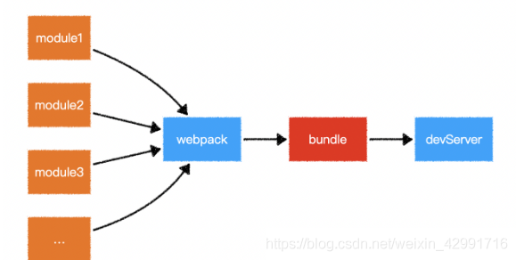
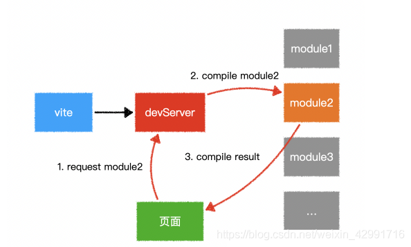
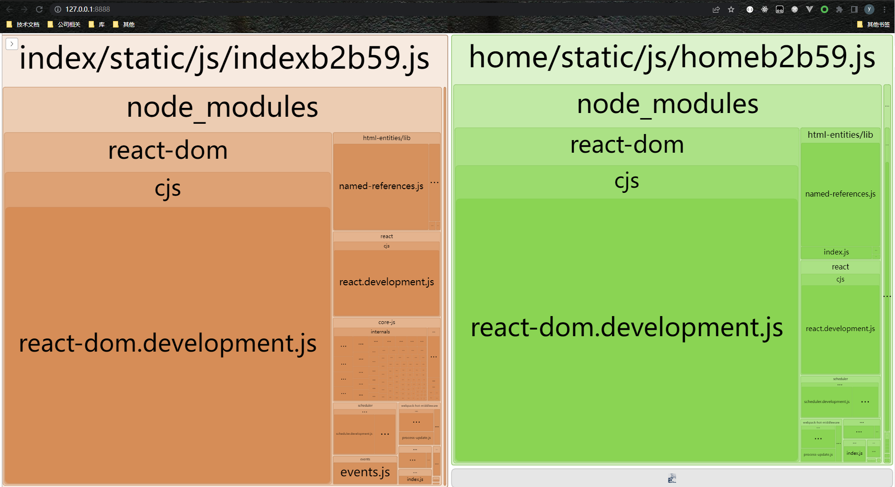
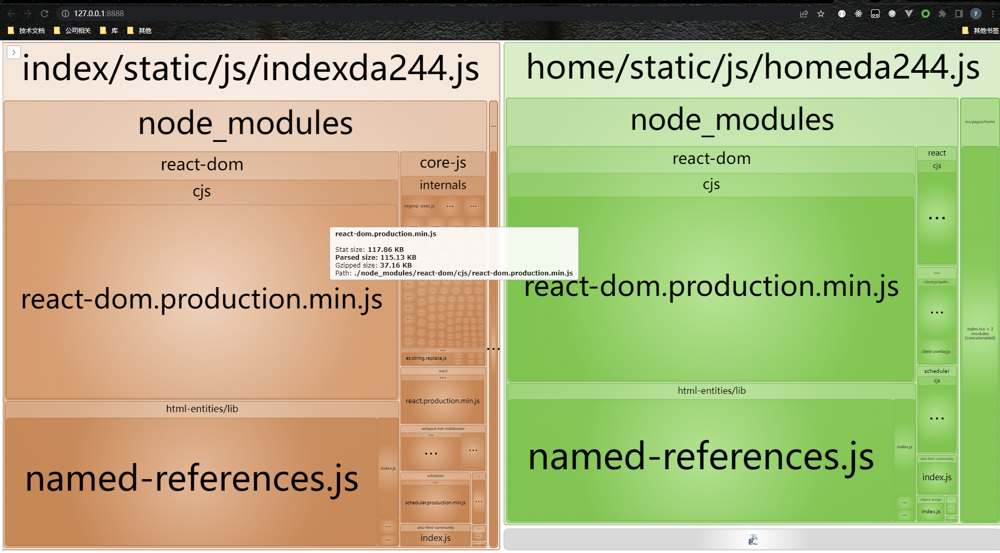

# webpack与其发展历程
${toc}
### 为什么需要构建工具

随着手机 移动平板和可穿戴设备的快速普及，web前端的开发也从传统的PC网页的开发发展到手机、平板、PC等多终端的开发，并且需要兼容市面上主流手机、平板和浏览器等，再者，前端技术发展之快，各种可以提高开发效率的新思想和框架层出不穷。但是它们都有一个共同点：源代码无法直接运行，必须通过转换后才可以正常运行。

### 构建工具是干什么的

- 构建就是将源代码转换成可执行的JavaScript、CSS、HTML代码，如：

> 代码转换：将TypeScript编译成JavaScript、将SCSS编译成CSS等。
> 文件优化：压缩JavaScript、CSS、HTML代码，压缩合并图片等。
> 代码分割：提取多个页面的公共代码，提取首屏不需要执行部分的代码让其异步加载。
> 模块合并：在采用模块化的项目里会有很多个模块和文件，需要通过构建功能将模块分类合并成一个文件。
> 自动刷新：监听本地源代码的变化，自动重新构建、刷新浏览器。
> 代码校验：在代码被提交到仓库前需要校验代码是否符合规范，以及单元测试是否通过。
> 自动发布：更新代码后，自动构建出线上发布代码并传输给发布系统。
> ......

### 演变历程：

1. 最早的前端开发，我们都是切图片，然后编写js和css代码，这些代码是未经压缩的。
2. 后面大家意识到代码发布上线希望代码逻辑不要暴露出来，因此会找一些在线工具，把源代码上传上去，通过在线工具进行压缩，再把压缩后的代码拷贝到本地目录中。
3. 到了07年，当时出了ant+Tool，可以将代码进行本地压缩。
4. 整个业界requireJs和SeaJs模块化的概念不断催生，因此前端的代码编写的方式，模块化的编写方式也越来越复杂。
5. 后来又演变出了grunt，他本质上是一个Task Runner，grunt会将整个构建过程分为一个一个的任务，每个任务做一件事情，比如在整个grunt里面，会将打包过程分为解析html、解析css、解析js，包括代码压缩和文件指纹等等，他会把这些都算成一个个任务，任务执行完成之后，会把任务执行结果存放到本次磁盘的目录中，这样因为存在本地磁盘的IO操作，势必会导致打包速度慢。
6. 由于打包速度问题，演变出了gulp，gulp有文件流的概念，每一个任务的结果不会存在本地磁盘的文件中，而是直接存放在内存中，在下一个步骤会直接使用上一个步骤的内存，这样会大大提高打包的速度。
7. 现阶段，使用的最多的打包工具是webpack，除此之外还有Rollup、parcel、vite等等。


### 为什么选择webpack


- 从GitHub stars和周下载量可以得知，webpack远远超过其他构建工具。

- webpack社区生态丰富：提供丰富的plugin和loader。配置灵活和插件化拓展：可以定义自己的loaders和插件来满足团队个性化的需要。

- 对比

  - vite 与 webpack

    - webpack：分析依赖 => 编译打包 => 交给本地服务器进行渲染。首先分析各个模块之间的依赖，然后进行打包，再启动webpack-dev-server，请求服务器时，直接显示结果。
    
        
    
    - vite：启动服务器=> 请求模块时按需动态编译显示。是先启动开发服务器，请求某个模块时再对该模块进行实时编译
    
        
    
    - webpack打包之后存在的问题：
    
        1. 缓慢的服务器启动
        2. 热更新效率低下，随着模块的增多，会造成打出的 bundle 体积过大，进而会造成热更新速度明显变慢。
    
    - vite缺点：
    
        1. 生态不如webpack
        2. prod环境的构建，目前用的Rollup，对于css和代码分割不是很友好
        3. 还没有被大规模使用,很多问题或者诉求没有真正暴露出来
  
  - rollup 与 webpack
    - webpack优势在于它更全面，基于一切皆模块的思想而衍生丰富的loader和plugin，几乎可以满足任何要求。
    - rollup它则更专注于JS的打包，虽然它也支持许多其他类型的模块，但总体来说通用性不如webpack，如果当前的需求仅是打包JS，我们应该首选rollup

### webpack五个核心概念

#### Entry

> 入口（entry）指示webpack以哪个文件为入口起点开始打包，分析构建内部依赖图。

```javascript
module.exports = {
  entry: './path/to/my/entry/file.js',
};
```

#### Output

  > 出口（output）指示webpack打包后的资源bundles输出到哪里去，以及如何命名。

```javascript
const path = require('path');

module.exports = {
  entry: './path/to/my/entry/file.js',
  output: {
    path: path.resolve(__dirname, 'dist'),
    filename: 'my-first-webpack.bundle.js',
  },
};
```
#### Loader 

  > 让webpack能够去处理那些非javascript文件，（比如将image，css翻译成webpack可以看懂的文件、webpack自身只能理解javascript）


```javascript
const path = require('path');

module.exports = {
  output: {
    filename: 'my-first-webpack.bundle.js',
  },
  module: {
    rules: [{ test: /\.txt$/, use: 'raw-loader' }],
  },
};

```

#### Plugins 

> 可以用于执行范围更广的任务。插件的范围包括从打包优化和压缩，一直到重新定义环境中的变量等。

```javascript
const HtmlWebpackPlugin = require('html-webpack-plugin');
const webpack = require('webpack'); //to access built-in plugins

module.exports = {
  module: {
    rules: [
        { test: /\.txt$/, use: 'raw-loader' }
    ],
  },
  plugins: [
      new HtmlWebpackPlugin({ template: './src/index.html' })
  ],
};
```

#### Mode

- development 

> 设置 process.env.NODE_ENV 为 DefinePluginvalue development。为模块和块启用有用的名称。

- production 

> 设置 process.env.NODE_ENV 为 DefinePluginvalue production。为模块和块启用确定性的错位名称、FlagDependencyUsagePlugin、FlagIncludedChunksPlugin 和 ModuleConcatenationPlugin、NoEmitOnErrorsPlugin、TerserPlugin

- none

```javascript
module.exports = {
  mode: 'none' | 'development' | 'production',
};
```

#### 其他配置

> **[resolve](https://webpack.js.org/configuration/resolve/)**、**[devtool](https://webpack.js.org/configuration/devtool/)**、**[devServer](https://webpack.js.org/configuration/dev-server/)** [...](https://webpack.js.org/configuration/)

### 常用loader与plugin

#### Loader

##### babel-loader

> babel-loader基于babel，用于解析JavaScript文件。
>
> Babel配置里的两大核心：插件数组(plugins) 和 预设数组(presets)。
>
> Babel 的预设（preset）可以被看作是一组Babel插件的集合，由一系列插件组成。

****常用预设****

- @babel/preset-env              ES2015+ 语法
- @babel/preset-typescript    TypeScript
- @babel/preset-react            React
- @babel/preset-flow              Flow

****插件和预设的执行顺序****

- 插件比预设先执行
- 插件执行顺序是插件数组从前向后执行

- 预设执行顺序是预设数组从后向前执行

****推荐阅读：****

- [babel配置文件相关文档](https://www.babeljs.cn/docs/configuration)
- [插件手册](https://github.com/jamiebuilds/babel-handbook/blob/master/translations/zh-Hans/plugin-handbook.md)

****webpack配置代码****

```bash
# 安装
yarn add babel-loader @babel/core @babel/preset-env @babel/preset-react @babel/plugin-proposal-class-properties
```

```js
// 方法一
// webpack.config.js
module: {
  rules: [
    {
      test: /\.m?js$/,
      exclude: /node_modules/,
      use: {
        loader: 'babel-loader',
        options: {
          presets: [
            ['@babel/preset-env', 
             {
                "corejs": 3,
                "useBuiltIns": "usage"
              }
            ],
            ["@babel/preset-react"]
          ],
          plugins: ['@babel/plugin-proposal-class-properties'],
        }
      }
    }
  ]
}

```

```json
// 方法二
// .babelrc.json
{
  "presets": [
    [
      "@babel/preset-env",
      {
        "corejs": 3,
        "useBuiltIns": "usage"
      }
    ],
    "@babel/preset-react"
  ]
}
```

##### ts-loader

> 为webpack提供的 TypeScript loader，打包编译Typescript

```bash
# 安装
yarn add ts-loader typescript
```

```js
module.exports = {
  module: {
    rules: [
      { test: /\.tsx?$/, loader: "ts-loader" }
    ]
  }
};
```

##### file-loader

> 用于处理文件类型资源，如jpg，png等图片。

```js
module.exports = {
  module: {
    rules: [
      {
        test: /\.(png|jpe?g|gif)$/i,
        loader: 'file-loader',
        type: "javascript/auto",
        options: {
          name: '[name]_[hash:8].[ext]',
          esModule: false,
          publicPath: "https://www.hyqin.com", 
        },
      },
    ],
  },
};
```

```css
/* index.less */
.tag {
  background-image: url(./webpack.png);
}
/* 编译后：*/
.tag {
  background-image: url(https://www.hyqin.com/webpack_605dc7bf.png);
}
```

注意：file-loader 在webpack5 环境下已经弃用，要想正确处理图片，需要配置两个属性。

- esModule: false （启用 CommonJS 模块语法）
- type: "javascript/auto" （停止当前 asset 模块的处理，并再次启动处理时，防止导致 asset 重复）

##### url-loader

> 与file-loader作用相似，也是处理图片的，只不过url-loader可以设置一个根据图片大小进行不同的操作，如果该图片大小大于指定的大小，则将图片进行打包资源，否则将图片转换为base64字符串合并到js文件里。

```js
module.exports = {
  module: {
    rules: [
        {
            test: /\.(png|jpg|git|webp)$/,
            loader: 'url-loader',
            type: 'javascript/auto',
            options: {
                // 这里单位为(b) 10240 => 10kb
                // 这里如果小于10kb则转换为base64打包进js文件，如果大于10kb则打包到对应目录
                limit: 8 * 1000,
                esModule: false,
                name: '/static/images/[name].[hash:8].[ext]'
        	}
        }
    ]
  }
}
```

注意：url-loader 和 file-loader 一样，在webpack5环境下已经弃用，也需要配置 `esModule: false`、`type: "javascript/auto" `属性

##### style-loader

> 通过注入style标签将CSS插入到DOM中
>
> 如果需要将CSS提取为一个文件(即不要将CSS存储在JS模块中)，此时你需要使用mini-css-extract-plugin插件
>
> 不要将 style-loader 和 mini-css-extract-plugin 针对同一个CSS模块一起使用！

****代码示例见postcss-loader****

##### css-loader

> 仅处理css的各种加载语法(@import和url()函数等),就像 js 解析 import/require() 一样

****代码示例见postcss-loader****

##### sass-loader

> 解析sass，转换为css

****代码示例见postcss-loader****

##### postcss-loader

> PostCSS 是一个允许使用 JS 插件转换样式的工具。 这些插件可以检查（lint）你的 CSS，支持 CSS Variables 和 Mixins， 编译尚未被浏览器广泛支持的先进的 CSS 语法，内联图片，以及其它很多优秀的功能。PostCSS 在业界被广泛地应用。PostCSS 的 ****autoprefixer**** 插件是最流行的 CSS 处理工具之一。autoprefixer 添加了浏览器前缀，

```bash
# 安装
yarn add postcss-loader autoprefixer sass-loader less-loader css-loader style-loader mini-css-extract-plugin
```

```js
// webpack.config.js
const MiniCssExtractPlugin = require('mini-css-extract-plugin')
const isDev = process.NODE_ENV === 'development'
module.exports = {
	module: {
		rules: [
			{
				test: /\.css$/,
				exclude: /node_modules/,
				use: [ isDev ? 'style-loader' : MiniCssExtractPlugin.loader, 'css-loader', 'postcss-loader' ]
			},
			{
				test: /\.scss$/,
				exclude: /node_modules/,
				use: [  isDev ? 'style-loader' : MiniCssExtractPlugin.loader, 'css-loader', 'postcss-loader', 'sass-loader' ]
			},
			{
				test: /\.less$/,
                exclude: /node_modules/,
				use: [ isDev ? 'style-loader' : MiniCssExtractPlugin.loader, 'css-loader', 'postcss-loader', 'less-loader' ]
			},
        ]
    }
```

在项目根目录创建postcss.config.js，并且设置支持哪些浏览器，必须设置支持的浏览器才会自动添加添加浏览器兼容

```js
module.exports = {
  plugins: [
    require('autoprefixer')({
      'browsers': [
        'defaults',
        'not ie < 11',
        'last 2 versions',
        '> 1%',
        'iOS 7',
        'last 3 iOS versions'
      ]
    })
  ]
}
```

#### Plugin

##### html-webpack-plugin

> 基本作用是生成html文件。
>
> 单页应用可以生成一个html入口，多页应用可以配置多个html-webpack-plugin实例来生成多个页面入口
>
> 为html引入外部资源如script、link，将entry配置的相关入口chunk以及mini-css-extract-plugin抽取的css文件插入到基于该插件设置的template文件生成的html文件里面。

```js
const HtmlWebpackPlugin = require('html-webpack-plugin');
const path = require('path')

module.exports = {
  entry: {
    index: path.resolve(__dirname, '../src/index/index.js'),
    home: path.resolve(__dirname, '../src/home/index.js'),
  },
  plugins: [
    new HtmlWebpackPlugin({
    	title: 'index',
      	// 生成的文件名称 相对于webpackConfig.output.path路径而言
      	filename: 'pages/news.html',
      	// 生成filename的文件模板
     	template: path.resolve(__dirname, '../public/index.html'),
        favicon: path.resolve(__dirname, '../public/favicon.ico'),
            chunks: ['index']
		excludeChunks：['home']
    }),
    new HtmlWebpackPlugin({
      	title: 'home',
 	    // 生成的文件名称
    	filename: 'pages/video.html',
      	// 生成filename的文件模板
   		favicon: path.resolve(__dirname, '../public/favicon.ico'),
      	template: path.resolve(__dirname, '../public/index.html'),
      	excludeChunks：['index']
    }),
  ]
};
```


##### clean-webpack-plugin

> 默认情况下，这个插件会删除webpack的output.path中的所有文件，以及每次成功重新构建后所有未使用的资源。

```js
const { CleanWebpackPlugin } = require('clean-webpack-plugin');
module.exports = {
    plugins: [
        new CleanWebpackPlugin(),
    ]
};
```

##### mini-css-extract-plugin

> 将 CSS 提取到单独的文件中，为每个包含 CSS 的 JS 文件创建一个 CSS 文件。

```js
// 建议 mini-css-extract-plugin 与 css-loader 一起使用
// 将 loader 与 plugin 添加到 webpack 配置文件中
const MiniCssExtractPlugin = require('mini-css-extract-plugin');

module.exports = {
  plugins: [new MiniCssExtractPlugin()],
  module: {
    rules: [
      {
        test: /\.css$/i,
        use: [MiniCssExtractPlugin.loader, 'css-loader'],
      }
    ],
  },
};
```

##### webpack.HotModuleReplacementPlugin

> 模块热替换插件，除此之外还被称为 HMR。
>
> 该功能会在应用程序运行过程中，替换、添加或删除 模块，而无需重新加载整个页面。主要是通过以下几种方式，来显著加快开发速度:
>
> - 保留在完全重新加载页面期间丢失的应用程序状态。
> - 只更新变更内容，以节省宝贵的开发时间。
> - 在源代码中 CSS/JS 产生修改时，会立刻在浏览器中进行更新，这几乎相当于在浏览器 devtools 直接更改样式。

```jsx
module.exports = {
  plugins: [
    // 大多数情况下不需要任何配置
    new webpack.HotModuleReplacementPlugin(),
  ],
    devServer: {
        // 仅在需要提供静态文件时才进行配置
        contentBase: outputPath,
        // publicPath: '', // 值默认为'/'
        compress: true,
        port: 8080,
        watchContentBase: true,
        hot: true,
        // 在服务器启动后打开浏览器
        open: true,
        // 指定打开// ****注意：HMR 绝对不能被用在生产环境。****浏览器时要浏览的页面
        openPage: ['pages/preview.html'],
        // 将产生的文件写入硬盘。 写入位置为 output.path 配置的目录
        writeToDisk: true,
    }
};  
// ****注意：HMR 绝对不能被用在生产环境。****
```

##### webpack.DefinePlugin

> 创建一个在编译时可以配置的全局常量。这会对开发模式和生产模式的构建允许不同的行为非常有用。因为这个插件直接执行文本替换，给定的值必须包含字符串本身内的实际引号。

```jsx
const isProd = process.env.NODE_ENV === 'production';
module.exports = {
  plugins: [
    new webpack.DefinePlugin({
      key: JSON.stringify(value)
    }),
  ]
}
```

#####  webpack-bundle-analyzer

> 可以看到项目各模块的大小，可以按需优化.一个webpack的bundle文件分析工具，将bundle文件以可交互缩放的treemap的形式展示。

```js
const BundleAnalyzerPlugin = require('webpack-bundle-analyzer').BundleAnalyzerPlugin;

module.exports = {
  plugins: [
    new BundleAnalyzerPlugin()
  ]
}
```


